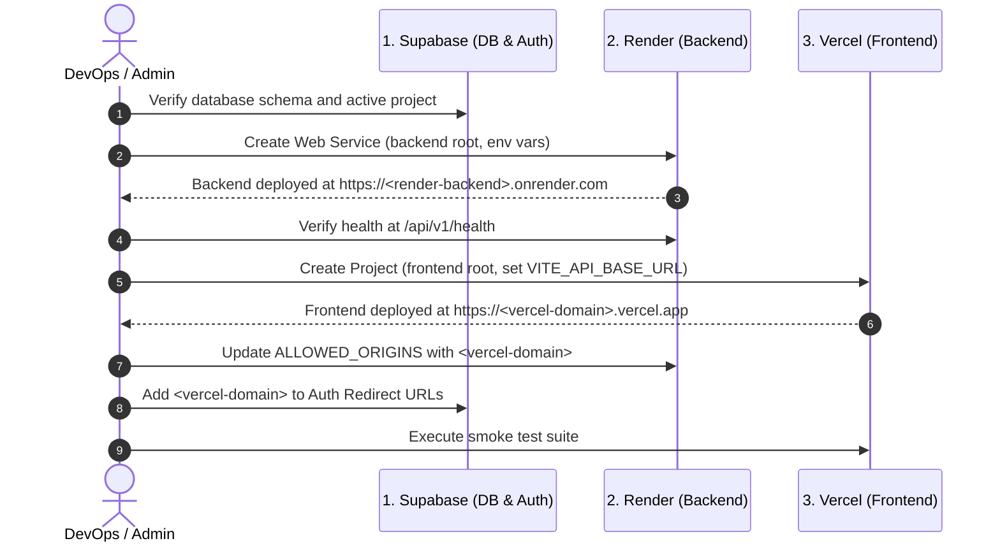

# PanelIQ Production Deployment Guide & Checklist

This guide outlines the production deployment procedure for **PanelIQ**, targeting:
- **Frontend**: Vercel (React + Vite SPA)
- **Backend**: Render Web Service (Node.js + Express)
- **Database**: Supabase PostgreSQL (Existing managed database)
- **AI Engine**: Groq (Primary) + Google Gemini (Secondary Fallback)

---

## 1. Vercel Configuration (Frontend)

| Setting | Value | Notes |
| :--- | :--- | :--- |
| **Framework Preset** | Vite | Automatically detected by Vercel |
| **Root Directory** | `frontend` | Monorepo subfolder |
| **Build Command** | `npm run build` | Runs `vite build` |
| **Output Directory** | `dist` | Default Vite build output directory |
| **Install Command** | `npm install` | Installs frontend dependencies |
| **SPA Routing** | Configured | Managed via `frontend/vercel.json` rewrites |

### SPA Routing Verification
Direct navigation and page reloads are handled by `frontend/vercel.json`:
```json
{
  "rewrites": [
    {
      "source": "/(.*)",
      "destination": "/index.html"
    }
  ]
}
```
This guarantees deep routes (e.g., `/app`, `/app/interviews/:id/report`, `/expert/sessions/:id`, `/admin/questions`) resolve cleanly to the SPA without 404 errors.

---

## 2. Render Configuration (Backend)

| Setting | Value | Notes |
| :--- | :--- | :--- |
| **Service Type** | Web Service | Linux container |
| **Runtime** | Node | Node.js environment |
| **Root Directory** | `backend` | Monorepo subfolder |
| **Build Command** | `npm install` | Installs backend dependencies |
| **Start Command** | `npm start` | Runs `node src/server.js` |
| **Health Check Path** | `/api/v1/health` | HTTP 200 health check endpoint |
| **Auto-Deploy** | Yes / On Commit | Deploy on push to production branch |

> [!NOTE]
> Render provides the `render.yaml` blueprint at the repository root. Alternatively, you can create the Web Service manually via the Render dashboard.

---

## 3. Required Frontend Environment Variables (Vercel)

Set these in the **Vercel Project Settings -> Environment Variables**:

| Variable | Description | Example / Format |
| :--- | :--- | :--- |
| `VITE_API_BASE_URL` | Deployed Render backend URL | `https://paneliq-backend.onrender.com` |
| `VITE_SUPABASE_URL` | Supabase project URL | `https://your-project-ref.supabase.co` |
| `VITE_SUPABASE_PUBLISHABLE_KEY` | Public publishable key | `sb_publishable_...` |
| `VITE_SUPABASE_ANON_KEY` | (Optional alias) | `sb_publishable_...` |

> [!CAUTION]
> **NEVER** expose backend secrets in the frontend environment. Do **NOT** set `SUPABASE_SERVICE_ROLE_KEY`, `GROQ_API_KEY`, or `GEMINI_API_KEY` on Vercel.

---

## 4. Required Backend Environment Variables (Render)

Set these in the **Render Web Service -> Environment**:

| Variable | Required | Default / Value | Description |
| :--- | :---: | :--- | :--- |
| `NODE_ENV` | Yes | `production` | Enables production optimizations and safe logging |
| `PORT` | Auto | Provided by Render (e.g. `10000`) | Server automatically binds to `0.0.0.0` |
| `NODE_VERSION` | Yes | `24.18.0` | Specifies Node.js runtime version |
| `ALLOWED_ORIGINS` | Yes | `https://your-domain.vercel.app,http://localhost:5173` | Comma-separated CORS origins allowlist |
| `SUPABASE_URL` | Yes | `https://your-project-ref.supabase.co` | Supabase root URL |
| `SUPABASE_PUBLISHABLE_KEY` | Yes | `sb_publishable_...` | Supabase client publishable key |
| `SUPABASE_SERVICE_ROLE_KEY` | Optional | `ey...` | Backend privileged key if needed |
| `AI_MODE` | Yes | `live` | Enables live AI providers (`live` / `mock` / `bank_only`) |
| `PRIMARY_AI_PROVIDER` | Yes | `groq` | Primary AI provider |
| `SECONDARY_AI_PROVIDER` | Yes | `gemini` | Secondary AI provider fallback |
| `GROQ_API_KEY` | Yes | `gsk_...` | Groq API key |
| `GROQ_MODEL` | Optional | `llama-3.3-70b-versatile` | Groq chat model |
| `GEMINI_API_KEY` | Yes | `AIzaSy...` | Google Gemini API key |
| `GEMINI_MODEL` | Optional | `gemini-3.5-flash-lite` | Gemini model |

---

## 5. CORS Setup

1. **Format**: Comma-separated list of fully qualified origins without trailing slashes.
   ```env
   ALLOWED_ORIGINS=https://paneliq.vercel.app,http://localhost:5173
   ```
2. **Behavior**:
   - The backend automatically trims spaces and trailing slashes.
   - Wildcards (`*`) are disallowed to prevent credential/authorization leakage.
   - Allowed methods: `GET, HEAD, PUT, PATCH, POST, DELETE, OPTIONS`.
   - Allowed headers: `Content-Type, Authorization, X-Request-Id`.
   - Exposed headers: `X-Request-Id` (accessible to the client application).
   - Preflight `OPTIONS` requests receive HTTP 204.
   - Unknown origins receive HTTP 403 Forbidden with `{ error: { code: 'FORBIDDEN' } }`.

---

## 6. Supabase Database Configuration

1. **Existing Database**: The backend connects to your existing Supabase PostgreSQL instance via the `@supabase/supabase-js` client with user token verification.
2. **No Build Migrations**: Automated migrations are **not** run during deployment builds to avoid accidental schema mutation or downtime.
3. **Auth Redirect URLs**:
   In **Supabase Dashboard -> Authentication -> URL Configuration**:
   - **Site URL**: `https://<your-vercel-domain>.vercel.app`
   - **Redirect URLs**:
     - `https://<your-vercel-domain>.vercel.app/**`
     - `https://<your-vercel-domain>.vercel.app/auth/callback`
     - `http://localhost:5173/**` (for local development)

---

## 7. AI Provider Configuration

- **Primary Provider (Groq)**: Uses `llama-3.3-70b-versatile` with an 8-second request timeout.
- **Secondary Provider (Gemini)**: Uses `gemini-3.5-flash-lite` with an 8-second request timeout as a fallback when Groq encounters rate limiting, server errors, or timeouts.
- **Fail-Safe Behavior**: If both providers fail or keys are absent, the application gracefully handles the error without crashing the server.
- **Privacy & Security**: Prompt responses are parsed safely; secrets, candidate raw answers, and stack traces are never printed to console logs.

---

## 8. Deployment Order



### Detailed Sequence:
1. **Verify Supabase**: Ensure database tables (`sessions`, `profiles`, `evaluations`, etc.) are up to date and active.
2. **Deploy Backend to Render**:
   - Link repository, set Root Directory = `backend`.
   - Set Build Command = `npm install`, Start Command = `npm start`.
   - Configure all required backend environment variables.
   - Wait for build to complete.
3. **Verify Backend Health**:
   - Query: `curl https://<your-backend>.onrender.com/api/v1/health`
   - Expect: `{"data":{"service":"paneliq-backend","status":"ok"},"requestId":"..."}`
4. **Deploy Frontend to Vercel**:
   - Link repository, set Root Directory = `frontend`.
   - Configure `VITE_API_BASE_URL` with your Render backend URL.
   - Configure `VITE_SUPABASE_URL` and `VITE_SUPABASE_PUBLISHABLE_KEY`.
   - Deploy.
5. **Close the Loop**:
   - Copy the deployed Vercel domain (e.g. `https://paneliq-app.vercel.app`).
   - Add it to `ALLOWED_ORIGINS` on Render.
   - Add it to Supabase Auth Redirect URLs.

---

## 9. Smoke Tests (Post-Deployment Verification)

Execute the following post-deployment checklist:

- [ ] **Health Check**: Ping `https://<render-backend>.onrender.com/api/v1/health` -> HTTP 200 `{ "status": "ok" }`.
- [ ] **SPA Direct Deep Linking**: Navigate directly in browser to `https://<vercel-domain>.vercel.app/app` and refresh the page -> Loads without 404.
- [ ] **Authentication**:
  - Test Sign In and Sign Up flows with Supabase Auth.
  - Verify JWT session persistence across page reloads.
- [ ] **Simulation Catalog**:
  - Open `/app/interviews/new`.
  - Confirm role catalog loads from `GET /api/v1/catalog`.
- [ ] **Interview Session**:
  - Start an interview session (`POST /api/v1/sessions`).
  - Answer or skip questions in the interview room.
- [ ] **AI Feedback / Follow-Up**:
  - Verify AI generates follow-up responses during active turns.
- [ ] **Evaluator & Report Flow**:
  - Verify completed session report generation (`GET /api/v1/sessions/:id/report`).
  - Verify transcript replay (`GET /api/v1/sessions/:id/replay`).
- [ ] **CORS Verification**:
  - In browser devtools, confirm no `Access-Control-Allow-Origin` errors occur on API calls.
  - Confirm `x-request-id` header is received and tracked.

---

## 10. Rollback & Redeploy Notes

### Backend Rollback (Render)
1. Go to **Render Dashboard -> paneliq-backend -> Deployments**.
2. Select the previous stable deployment and click **Rollback to this deploy**.
3. If an environment variable issue caused the failure, edit the variable in **Environment** and click **Save Changes** (triggers immediate zero-downtime redeployment).

### Frontend Rollback (Vercel)
1. Go to **Vercel Dashboard -> paneliq-frontend -> Deployments**.
2. Find the previous stable production deployment.
3. Click the three dots menu `(...)` and click **Promote to Production** (instant rollback in < 5 seconds).

### Common Deployment Troubleshooting
- **CORS Error (403 Forbidden)**: Ensure the exact Vercel frontend origin (without trailing slash) is included in Render's `ALLOWED_ORIGINS` environment variable.
- **Render Cold Start (Free Tier)**: Render free tier services spin down after 15 minutes of inactivity. First request may take 30-50 seconds to respond. Health check path `/api/v1/health` wakes up the instance.
- **AI Rate Limit**: If Groq experiences rate limits (`429`), the fallback engine automatically routes the request to Google Gemini.
